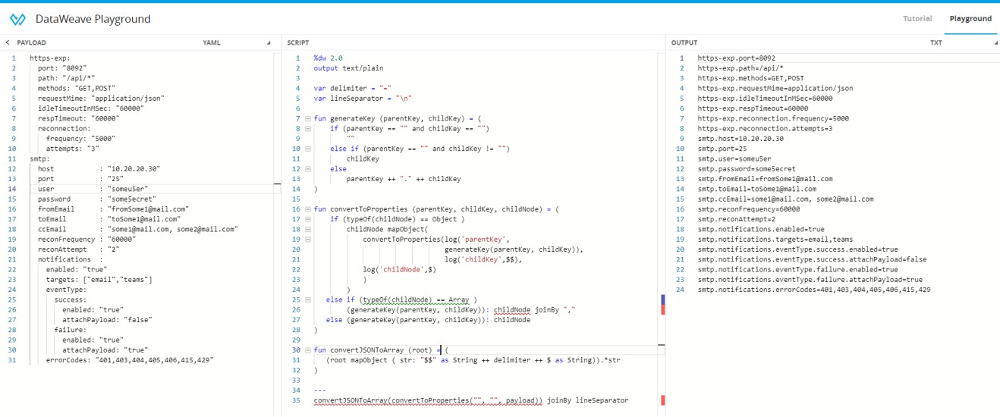

# conversions-using-dataweave
Format Conversions using dataweave

1.  **Convert yaml to application properties (key=value) pairs**

2.  **Convert application properties (key=value) pairs to yaml**

