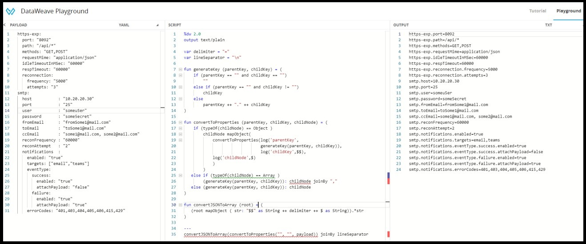

# conversions-using-dataweave
Format Conversions using dataweave

1.  **Convert yaml to application properties (key=value) pairs**

      * Use input sample [yaml-input.yaml]

      * Use dw script for transformation [yaml-to-properties.dw]

  

2.  **Convert application properties (key=value) pairs to yaml**

      * Use input sample [properties-input.properties]

      * Use dw script for transformation [properties-to-yaml.dw]

